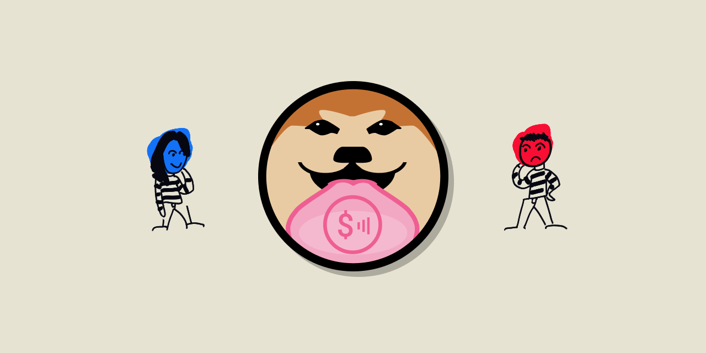
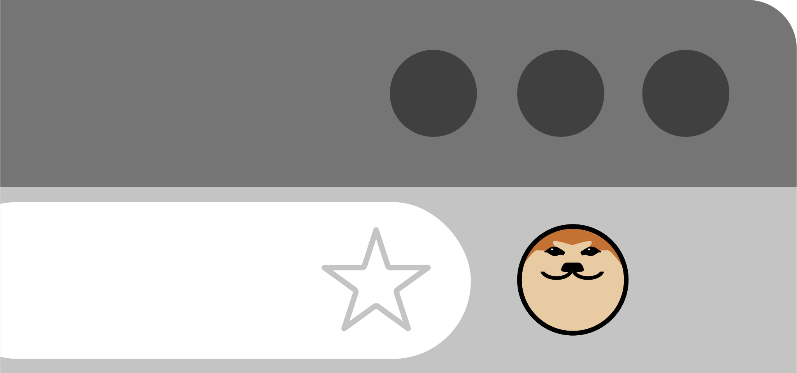
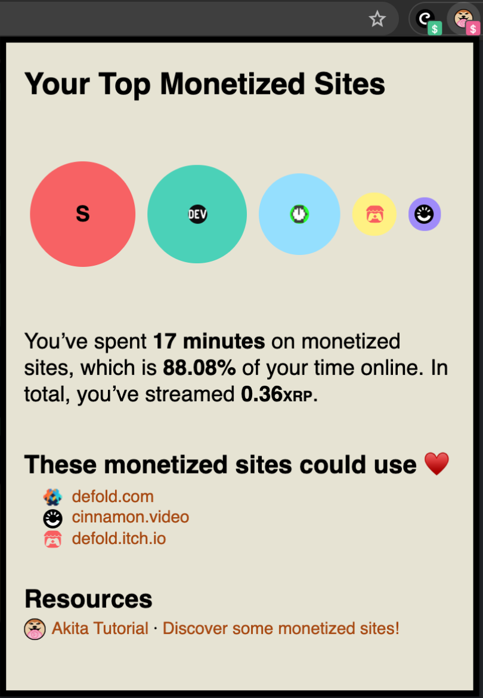
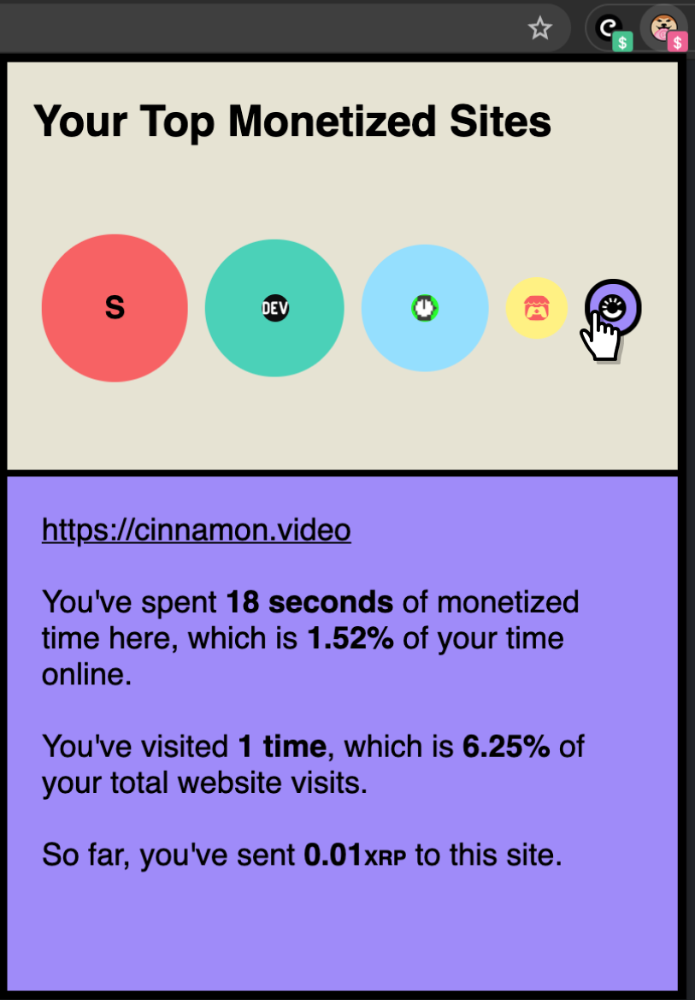
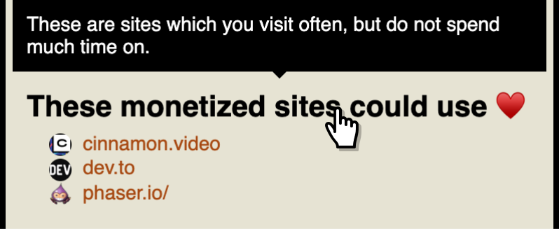
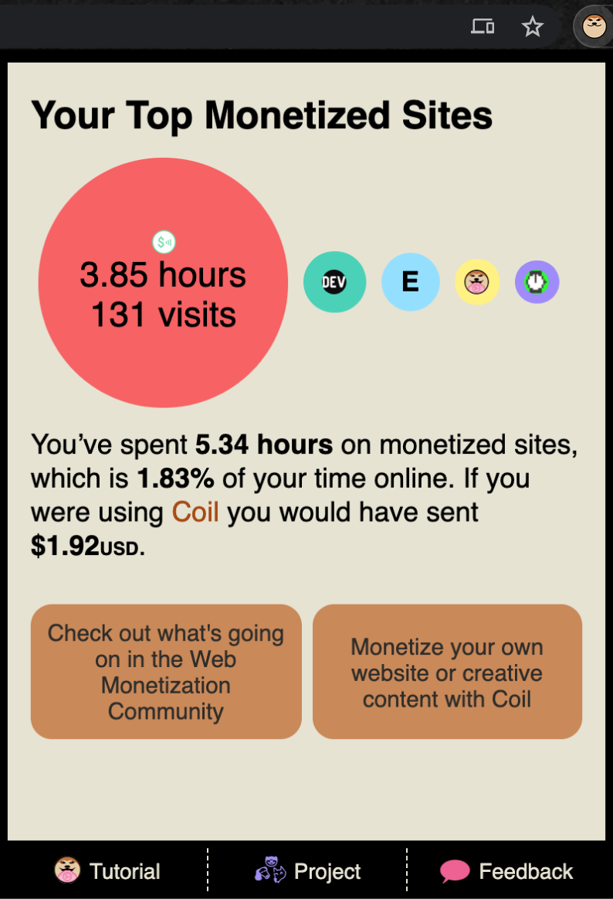
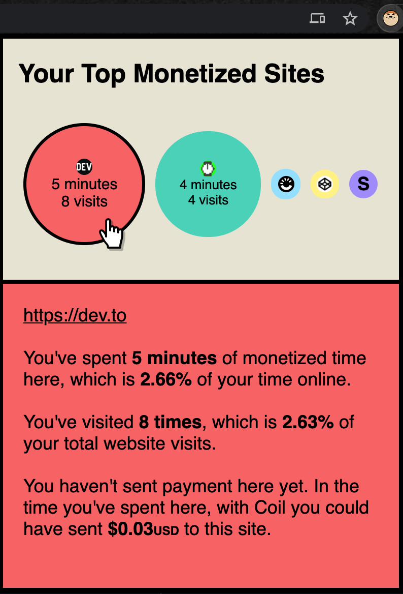

# Akita

<!-- License Badges -->

<!-- Social Badges -->

<!-- Installation Badges -->
<!--
  Note, at the time of adding the Edge badge below, there is no officially documented API for retrieving the add on details, so the method from https://github.com/badges/shields/issues/4690#issuecomment-647573617 has been used.
-->

A browser extension that gives you insight into your engagement with [Web Monetization](https://webmonetization.org/), part of [The Akita Project](https://akitaproject.site/).

Akita presents your top visited monetized sites, how much time you’re spending on them, and how much you're contributing (or could contribute) to them.

We've built this for the [Grant for the Web x DEV hackathon](https://dev.to/devteam/announcing-the-grant-for-the-web-hackathon-on-dev-3kd1)! We're so thrilled to have received a Runner Up Award for this project 🎉 - [Winners Announcement](https://dev.to/devteam/announcing-the-grant-for-the-web-x-dev-hackathon-winners-1nl4).

Our license information can be found [here](docs/LicenseInfo.md) and our license/copyright notices can be found in [LICENSE](LICENSE). Assets in the [assets/external](assets/external) directory are assets from another source or repository, which may not have been created by Akita contributors. Please refer to the per-asset/per-source license information in [assets/external](assets/external).

<table>
  <tr>
      <td align="center"></td>
      <td><strong>Grant for the Web x DEV Community Hackathon Runner Up</strong> (June 2020)</td>
  </tr>
  <tr>
      <td align="center"></td>
      <td><strong>Grant for the Web Mid Level Grantee</strong> (October 2020)</td>
  </tr>
</table>

---

## Table of Contents
  - [Installing](#installing)
  - [Contributing](#contributing)
  - [Screenshots & Demos](#screenshots--demos)
  - [About Akita](#about-akita)
    - [The Problem We're Addressing](#the-problem-were-addressing)
    - [How Akita Helps](#how-akita-helps)
    - [Blog Posts on Our Process](#blog-posts-on-our-process)
    - [Why 'Akita'?](#why-akita)
    - [Akita Data](#akita-data)
  - [Connect with Us](#connect-with-us)

---

## Installing
Check out the instructions to install from source or package [here](docs/InstallAkita.md).

You can also install Akita from Browser Extension/Add-On Stores:

- [Chrome Web Store](https://chrome.google.com/webstore/detail/akita/phcipgphomfgkenfmjnbmajdiejnlmgg)
- [Firefox Browser Add-ons](https://addons.mozilla.org/en-US/firefox/addon/akita/)
- [Microsoft Edge Add-ons](https://microsoftedge.microsoft.com/addons/detail/akita/halamaefcdjalhjgkbefalmhpnboncoc)

---

## Contributing
We'd love to have you be a part of Akita! Please feel free to open issues or create pull requests. Check out our [Contributing Guidelines](CONTRIBUTING.md) to get started!

---

## Screenshots & Demos

### Akita Extension Icon
The Akita extension icon changes depending on the site you are visiting. If the site has monetization enabled, then the Akita icon will look something like this:

Otherwise, if the site does not have monetization enabled, then the icon will appear as:

### Akita Main View
Our browser extension helps you see the top monetized sites you visit and your engagement with Web Monetization at-a-glance.

Here's a screenshot of what Akita looks like if you're using a Web Monetization provider:

You'll likely have some monetized sites that you visit often, but don't really spend much time on. Maybe you'd like to give them a little more love and spend a bit more time there, so that additional payment can be streamed to them. Check out the 'These monetized sites could use ♥️' section!

Here's a screenshot of what Akita looks like if you don't have a Web Monetization provider installed:

### Akita Demo Video
Click to check out a video walkthrough of Akita:

---

## About Akita

### The Problem We're Addressing

Web Monetization is an exciting new concept! It's paving the way for a more open, fair and inclusive web, to better support both users and creators. But, it's not exactly the easiest concept to understand. It took hours of research and reading before Web Monetization clicked for @elliot and I.

Once we had a grasp of Web Monetization, we realized that the journey to Web Monetization enlightenment was not an easy one. We could see a few major hurdles to overcome along the way:
- **Understanding how it works:** if you don't have technical experience, you aren’t enabled to see the big picture and if you do have technical experience, you may still face a steep learning curve.
- **Being comfortable with what it costs:** putting money into something you don't understand doesn't feel safe and you may not be in a position to put in money anyways.
- **How it relates to you:** it’s not clear how Web Monetization affects the way you interact with websites.

Because of these hurdles, it can be difficult to see the value and broad potential of Web Monetization. We felt like there was a gap - although there’s a good amount of content explaining Web Monetization, we wished there was a free and easy way to _experience_ Web Monetization.

### How Akita Helps

If you’re looking to start supporting websites by streaming payment, Akita will give you a good idea of which sites you can directly support through Web Monetization. If you’re already using a Web Monetization payment provider, Akita gives you insight into your contributions to the website by showing you the time spent on the site and the amount of payment streamed as a result.

As Web Monetization becomes more common on websites, you’ll be able to see the evolution through Akita. We hope to see your favourite sites join the Web Monetization community! All of the data collected about your browsing and streamed payments is stored in local browser storage, so **all of this information stays in your hands**.

Overall, our goal with Akita is to increase Web Monetization exposure and awareness, and to help people understand how Web Monetization fits in with their regular browsing. We want to give people who aren’t using a Web Monetization provider a way to engage in payment streaming. As more Web Monetization providers pop up, users can choose providers that fit their needs based on the browsing data presented by Akita.

### Blog posts on our process
1. [Kickstarting a project idea: going from 0 to...0 - Part 1](https://dev.to/esse-dev/kickstarting-a-project-idea-going-from-0-to-0-part-1-3o2e)
2. [Kickstarting a project idea: going from 0 to...0 - Part 2](https://dev.to/esse-dev/kickstarting-a-project-idea-going-from-0-to-0-part-2-3bph)
3. [How can you support websites without having to deal with annoying ads?](https://dev.to/esse-dev/how-can-you-support-websites-without-having-to-deal-with-annoying-ads-3lmb)
4. [Hackathon Update: Breaking Our Idea Down Into Dog-Treat-Sized Tasks](https://dev.to/esse-dev/hackathon-update-breaking-our-idea-down-into-dog-treat-sized-tasks-50e3)
5. [Akita: Get Involved in Web Monetization With or Without the Price Tag](https://dev.to/esse-dev/akita-get-involved-in-web-monetization-with-or-without-the-price-tag-cd8) (Hackathon Submission Post
6. [Akita — Grant Report #1](https://community.interledger.org/akita/akita-grant-report-1-3c1n)
7. [Support us by taking the Akita Beta Release Survey](https://community.interledger.org/akita/support-us-by-taking-the-akita-beta-release-survey-2fk4)

### Why 'Akita'?
Naming projects can be pretty challenging. We spent a good chunk of time coming up with various names before deciding to stay true to our "brand" at the time of the hackathon, which was _dog-s_, and selecting "Akita" as our project name.

The Akita is a Japanese dog breed known for its loyalty and dedication. It's also quite fluffy. We were drawn to "Akita" because of the values the breed represents (i.e. loyalty, dedication), as those characteristics are what we want to embrace with our project. Through Akita and Web Monetization, we want to enable mutual loyalty and dedication between content creators/websites and their users.

We were also very inspired by the story of [Hachikō](https://en.wikipedia.org/wiki/Hachik%C5%8D) - a dog of immense loyalty. Hachikō was an Akita who would meet with his owner every day at the train station. Even after his owner passed away, Hachikō continued to wait for his owner at the train station for more than 9 years. Hachikō continues to have a legacy in Japanese culture, with various statues created in his memory - there was even an [American film](https://en.wikipedia.org/wiki/Hachi:_A_Dog%27s_Tale) based on him.

### Akita Data
Akita collects data on

- your time spent and number of visits on all websites,
- the [Payment Pointers](https://paymentpointers.org/) present on the websites you visit,
- and the currency and amount of payments streamed to Payment Pointers via Web Monetization.

You can view an example of the data collected by Akita in [`examples/example_data.json`](examples/example_data.json).
The data collected by Akita is stored on your machine, in your browser's local storage.
Your data stays in your hands: it is not backed up, shared, or uploaded anywhere.
Therefore, if you uninstall the Akita browser extension, your data will be **permanently deleted** and will not be recoverable.

For more info, check out [Akita's Privacy Policy](docs/PrivacyPolicy.md).

---

## Connect with Us
- Email
  - [AkitaFeedback@gmail.com](mailto:AkitaFeedback@gmail.com)
- Interledger Community Forem (formerly Web Monetization Community Forem)
  - [Akita](https://community.interledger.org/akita)
  - [Elliot](https://community.interledger.org/elliot)
  - [Sharon](https://community.interledger.org/sharon)
- DEV
  - [esse-dev](https://dev.to/esse-dev)
  - [Elliot](https://dev.to/elliot)
  - [Sharon](https://dev.to/sharon)
- Discord
  - [Akita Discord Server](https://discord.gg/psyNbWW)
- Twitter
  - [esse_dev](https://twitter.com/esse_dev)
  - [Elliot](https://twitter.com/elliotokay)
  - [Sharon](https://twitter.com/_sharonwang)
- LinkedIn
  - [esse dev](https://www.linkedin.com/company/esse-dev)
